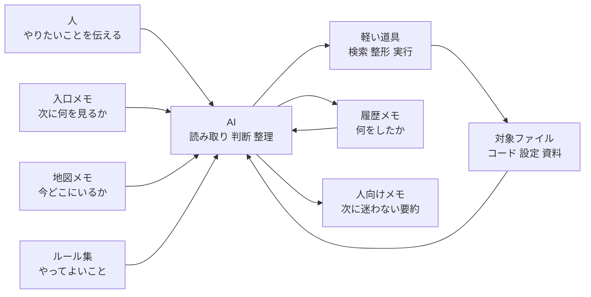
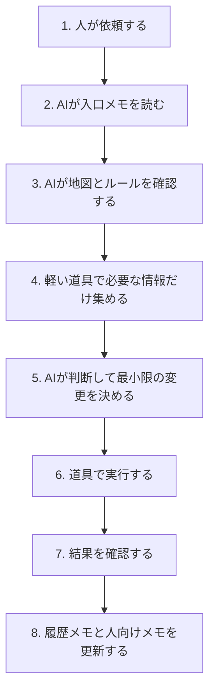

# AI活用の全体像 やさしい図解

更新日: 2026-03-30 JST

この資料は、ある現場で洗練されてきた AI の使い方を、固有名詞なしで、ほかの現場にも持ち運べる形へ言い換えたものです。

結論から言うと、この使い方の本質は、`AIを何でも屋にしないこと` です。
AI には「考えて決める役」を任せ、繰り返し作業は軽い道具へ分け、記録も役割ごとに分けます。
これだけで、AI が迷いにくくなり、人も引き継ぎしやすくなります。

## まず全体図



図が表示されない環境では、次の 1 行で捉えると分かりやすいです。

```text
人の依頼 → AIの判断 → 軽い道具の実行 → 対象ファイルの更新 → 記録 → 次回のAI
```

## ひとことで言うと

- `入口メモ`
  - AI が毎回最初に見る短い紙です。
  - 「今いちばん大事なこと」だけを書きます。
- `地図メモ`
  - 全体の進み具合を見る紙です。
  - 「今はどの段階か」を確認します。
- `ルール集`
  - してよいこと、避けること、書き方を決める紙です。
  - AI の暴走を防ぐ役目です。
- `軽い道具`
  - 検索、確認、整形、実行などの定型作業を受け持ちます。
  - 毎回 AI が長く考えなくてよいようにします。
- `履歴メモ`
  - 何をやったかを残す紙です。
  - 後から見返すための記録です。
- `人向けメモ`
  - 次に人が読む短いまとめです。
  - 細かい話より「結局どうなったか」を残します。

## この構図の強み

### 1. AI が毎回ゼロから考えなくてよい

AI が最初に見るものを固定すると、毎回の出だしが安定します。
すると、前回の流れを忘れにくくなり、見当違いの行動も減ります。

### 2. AI の仕事と道具の仕事を分けている

AI は便利ですが、全部を直接やらせると重くなります。
そのため次のように分担します。

```text
AIの役目       = 読む、比べる、判断する、要点を書く
道具の役目     = 探す、集める、整える、実行する
記録の役目     = 次回の入口になる
人の役目       = 目的を決める、最終判断をする
```

この分担があると、AI は「判断が必要なところ」に集中できます。

### 3. 記録が混ざらない

多くの現場では、次の 3 つが同じ紙に混ざって壊れます。

- 今すぐ必要なこと
- 昔の履歴
- 人向けの説明

この使い方では、それぞれを別の紙に分けます。
だから、AI も人も、開く場所に迷いにくくなります。

## 実際の流れ



## それぞれの段階をやさしく説明すると

### 1. 人が依頼する

最初に必要なのは、完璧な指示ではありません。
「何に困っているか」「何を見えるようにしたいか」が分かれば十分です。

### 2. AI が入口メモを読む

ここで AI は、いま最優先のことをつかみます。
大事なのは、長い履歴ではなく、`次の判断に必要な情報だけ` を置くことです。

### 3. AI が地図とルールを確認する

AI は、どの段階の作業か、何を勝手にしてはいけないかをここで確認します。
このひと手間で、危ない変更や無駄な寄り道が減ります。

### 4. 軽い道具で必要な情報だけ集める

AI が全部を目で追うのではなく、検索や一覧取得のような軽い処理で、必要な範囲だけ絞ります。
これは「虫眼鏡を使ってから読む」に近いです。

### 5. AI が判断して最小限の変更を決める

この運用では、最初から大改造しません。
まず対象、影響、関連する流れを見て、必要最小限に絞って直します。

### 6. 道具で実行する

決めたあとは、実行や整形のような手順を道具に任せます。
これにより、同じ作業を何度やってもぶれにくくなります。

### 7. 結果を確認する

変えたら終わりではありません。
ちゃんと狙った通りになったかを確認して、できたことと、まだやっていないことを切り分けます。

### 8. 履歴メモと人向けメモを更新する

ここがとても重要です。
AI が賢く見える理由のかなりの部分は、実はこの記録の整い方にあります。
次の人や次の AI が迷わないように、入口と履歴を分けて残します。

## この仕組みを図で言い換えると

```text
人が目的を決める
  ↓
AIが状況を読む
  ↓
軽い道具が手を動かす
  ↓
結果を記録する
  ↓
次回のAIがその記録を入口として読む
```

つまり、`人 → AI → 道具 → 記録 → 次のAI` という輪で回っています。
この輪が整うほど、運用は強くなります。

## なぜ「洗練されている」と感じやすいのか

見た目は単純ですが、実は次の考え方が入っています。

- AI を主役にしすぎず、役割を限定している
- 記録を「入口」「地図」「履歴」「人向け要約」に分けている
- 重い確認を減らし、必要な情報だけ見るようにしている
- 変更前に周辺確認を入れて、事故を減らしている
- 実行した場所と内容を残し、再現しやすくしている

つまり、すごいのは AI 単体ではなく、`AIが働きやすい場の設計` です。

## 他の現場でもそのまま使える型

次の 4 点をそろえるだけで、かなり再現できます。

### 最低限そろえるもの

1. `入口メモ`
   - 今すぐ大事なことだけを書く
2. `地図メモ`
   - 今どの段階かだけを書く
3. `履歴メモ`
   - 実施した事実だけを書く
4. `ルール集`
   - 勝手にしてはいけないことを書く

### 運用の型

1. AI は毎回、入口メモから始める
2. 長い履歴は入口に置かない
3. 定型作業は軽い道具へ分ける
4. AI には判断と要約を主に任せる
5. 作業後は入口と履歴を必要最小限だけ更新する

## 素人向けのたとえ

これは「優秀な助手」に仕事を頼む形に似ています。

- 玄関に今日の伝言メモがある
- 壁に全体予定表がある
- 禁止事項の紙が貼ってある
- 助手は必要な棚だけ見に行く
- 作業したら、日報と引き継ぎメモを書く

この形なら、助手が入れ替わっても回りやすいです。
AI も同じで、頭の良さだけより、`迷わない職場` を作る方が効きます。

## 最後に

この AI 活用法の本質は、最新の技術名ではありません。
本質は次の 3 つです。

- `入口を固定する`
- `役割を分ける`
- `記録を次回の資産にする`

この 3 つができると、AI は単発の便利道具から、継続して使える実務の相棒に変わります。
