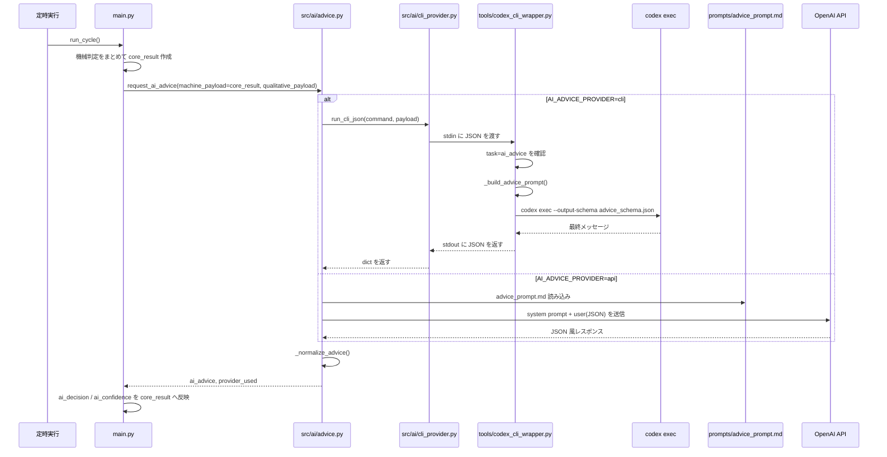

# FXシステム AIやりとり完全フロー Obsidian用

更新日: 2026-03-30 JST

この資料は、この repo の実装をもとに、`AI とどこで何をやりとりしているか` を実ファイル名ベースで見える化したものです。
Obsidian の Mermaid 表示を前提にしています。

## 1. 全体フロー

```mermaid
flowchart TD
    A["定時実行<br>`main.py::main()`"] --> B["1サイクル開始<br>`main.py::run_cycle()`"]
    B --> C["heartbeat 更新<br>`heartbeat.txt`"]
    C --> D["前回失敗メール再送<br>`src/notification/email_sender.py::resend_pending_email()`<br>`logs/errors/pending_email.json`"]
    D --> E["市場データ取得<br>`src/data/fetcher.py`<br>`src/data/exchange_fetcher.py`"]
    E --> F["テクニカル計算・構造判定<br>`src/analysis/*`<br>`src/indicators/*`"]
    F --> G["機械判定を集約して `core_result` を作成<br>`main.py`"]

    G --> H["AI助言リクエスト<br>`src/ai/advice.py::request_ai_advice()`"]
    H --> I{"`AI_ADVICE_PROVIDER`"}
    I -->|cli| J["CLI 実行<br>`src/ai/cli_provider.py::run_cli_json()`"]
    I -->|api| K["API 実行<br>`src/ai/advice.py::_request_ai_advice_via_api()`"]

    J --> L["`tools/codex_cli_wrapper.py`<br>stdin で JSON 受信"]
    L --> M["task=`ai_advice` を見て<br>助言用プロンプト生成<br>`_build_advice_prompt()`"]
    M --> N["`codex exec` 実行<br>最終メッセージ取得"]
    N --> O["JSON を stdout 返却<br>`decision / quality / confidence / primary_reason ...`"]
    O --> P["`src/ai/advice.py` で正規化<br>`_normalize_advice()`"]

    K --> Q["`prompts/advice_prompt.md` 読み込み"]
    Q --> R["OpenAI へ送信<br>messages = system + user(JSON)"]
    R --> P

    P --> S["`core_result.ai_advice` へ格納<br>`ai_decision` `ai_confidence` 反映"]
    S --> T["通知ランク計算<br>`src/analysis/signal_tier.py`"]
    T --> U["Phase1 サイズ計画・出口計画<br>`src/trade/*`"]
    U --> V["前回結果読込<br>`logs/last_result.json`<br>`logs/last_notified.json`<br>`logs/last_attention_notified.json`"]
    V --> W["通知要否判定<br>`src/notification/trigger.py::should_notify()`"]

    W --> X["本文生成<br>`src/ai/summary.py::build_summary_body()`"]
    X --> Y["件名生成<br>`src/ai/summary.py::build_summary_subject()`"]
    Y --> Z["評価トレース生成<br>`src/analysis/evaluation_trace.py::build_evaluation_trace()`"]

    Z --> AA{"通知するか"}
    AA -->|yes| AB{"`DRYRUN_MODE`"}
    AB -->|true| AC["送信せず通知済み扱い<br>`logs/last_notified.json` または<br>`logs/last_attention_notified.json` 更新"]
    AB -->|false| AD["SMTP 送信<br>`src/notification/email_sender.py::send_email()`"]
    AD --> AE{"送信成功?"}
    AE -->|yes| AF["通知済み JSON 更新<br>`logs/last_notified.json` または<br>`logs/last_attention_notified.json`"]
    AE -->|no| AG["未送信退避<br>`logs/errors/pending_email.json`<br>エラーログ保存"]
    AA -->|no| AH["通知は送らない"]

    AC --> AI["chart pattern shadow 付与<br>`src/analysis/chart_pattern_shadow.py`"]
    AF --> AI
    AG --> AI
    AH --> AI

    AI --> AJ["スナップショット保存<br>`logs/signals/signal_id.json`<br>`src/storage/json_store.py::save_signal_snapshot()`"]
    AJ --> AK["CSV 追記<br>`logs/csv/trades.csv`<br>`src/storage/csv_logger.py::append_trade_log()`"]
    AK --> AL["最新結果保存<br>`logs/last_result.json`"]
    AL --> AM["レビュー導線で再利用<br>`tools/log_feedback.py`<br>`logs/review/review_form_state.json`"]
```

## 2. AI助言のやりとり詳細



## 3. 要約本文と通知の流れ

```mermaid
flowchart TD
    A["`core_result` 完成"] --> B["通知判定<br>`src/notification/trigger.py`"]
    B --> C["`notification_kind` 決定<br>`main / attention / none`"]
    C --> D["本文生成<br>`src/ai/summary.py::build_summary_body()`"]
    D --> E["件名生成<br>`src/ai/summary.py::build_summary_subject()`"]
    E --> F["`summary_subject` `summary_body` を `core_result` へ格納"]
    F --> G{"通知するか"}
    G -->|yes| H["`src/notification/email_sender.py::send_email()`"]
    G -->|no| I["送信なし"]
    H --> J["成功時:<br>`logs/last_notified.json` または<br>`logs/last_attention_notified.json` 保存"]
    H --> K["失敗時:<br>`logs/errors/pending_email.json` 保存"]
    I --> L["それでも `logs/last_result.json` は保存"]
    J --> L
    K --> L
```

## 4. 実際に AI へ渡されるもの

```mermaid
flowchart LR
    A["`main.py` の `core_result`"] --> B["機械判定の主データ"]
    A --> C["価格・ゾーン・RR・phase"]
    A --> D["confidence / prelabel / risk_flags"]
    A --> E["long_setup / short_setup"]

    F["`build_qualitative_context()`"] --> G["文章寄りの補助文脈"]

    B --> H["AI助言入力 payload"]
    C --> H
    D --> H
    E --> H
    G --> H

    H --> I["CLI なら stdin JSON<br>API なら user message JSON"]
```

## 5. 実際に AI から返ってくるもの

```mermaid
flowchart LR
    A["AI 返却値"] --> B["`decision`<br>LONG / SHORT / WAIT / NO_TRADE ..."]
    A --> C["`quality`<br>A / B / C"]
    A --> D["`confidence`<br>0-1 または 0-100"]
    A --> E["`primary_reason`"]
    A --> F["`market_interpretation`"]
    A --> G["`warnings[]`"]
    A --> H["`next_condition`"]

    B --> I["`src/ai/advice.py::_normalize_advice()`"]
    C --> I
    D --> I
    E --> I
    F --> I
    G --> I
    H --> I

    I --> J["`core_result.ai_advice`"]
    I --> K["`core_result.ai_decision`"]
    I --> L["`core_result.ai_confidence`"]
```

## 6. どこに何が残るか

```mermaid
flowchart TD
    A["1回のサイクル終了"] --> B["`logs/signals/signal_id.json`<br>その時点の完全スナップショット"]
    A --> C["`logs/csv/trades.csv`<br>一覧で比較しやすい表形式"]
    A --> D["`logs/last_result.json`<br>最新の1件"]
    A --> E["`logs/last_notified.json`<br>最後の本命通知"]
    A --> F["`logs/last_attention_notified.json`<br>最後の注意報通知"]
    A --> G["`logs/errors/*.log`<br>AI失敗・SMTP失敗など"]
    A --> H["`logs/errors/pending_email.json`<br>メール再送待ち"]
    C --> I["`tools/log_feedback.py`"]
    D --> J["`tools/build_prod_status_summary.py`"]
    E --> I
    F --> I
    I --> K["`logs/review/review_form_state.json`"]
```

## 7. 読み方の要点

- AI との本当のやりとり開始点は `main.py` の `request_ai_advice(...)` です。
- AI への入力の中心は `core_result` で、これは機械判定の総まとめです。
- `CLI` の場合は `tools/codex_cli_wrapper.py` が AI との橋渡しです。
- `API` の場合は `src/ai/advice.py` が直接 API を呼びます。
- 現在の本文生成 `src/ai/summary.py` は、実装上は AI 再問い合わせではなくコード生成です。
- つまり、今の「AIとの対話」の本体は主に `助言フェーズ` にあります。
- その助言結果が通知文、件名、保存 JSON、レビュー集計へ連鎖していきます。

## 8. 一言でまとめると

```text
市場データ → 機械判定(core_result) → AI助言 → 通知判定 → 件名/本文生成 → メール送信 → JSON/CSV保存 → 人レビュー
```
