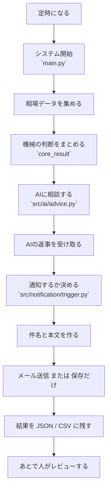
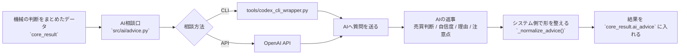
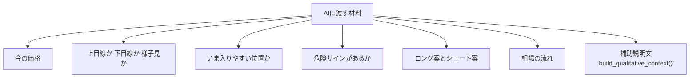
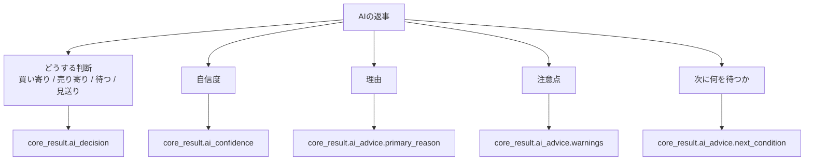
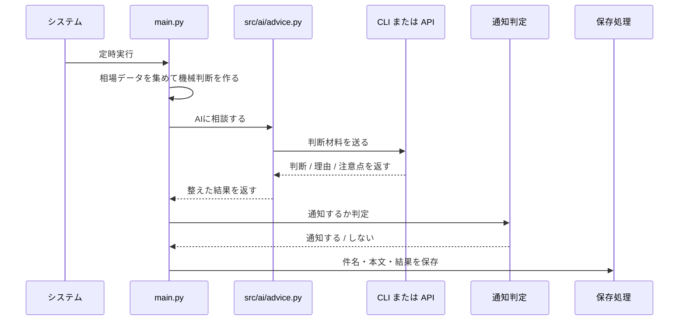
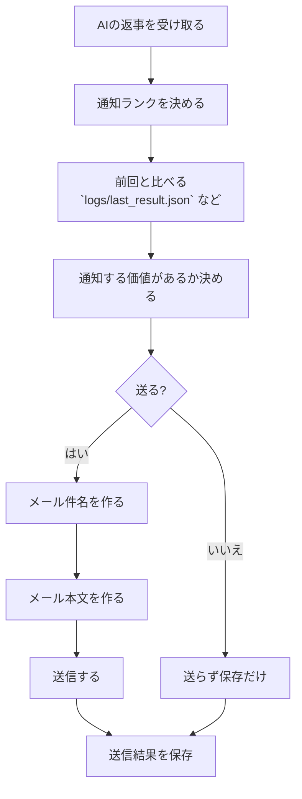
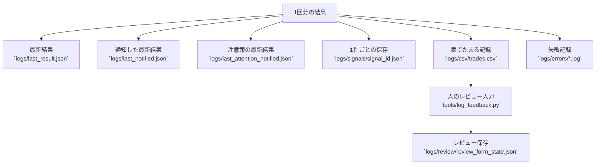

# FXシステム AIやりとり完全フロー やさしい版 Obsidian用

更新日: 2026-03-30 JST

この資料は、FX監視システムの中で、AI がどこで呼ばれて、何を見て、何を返し、その結果がどこへ残るかを、できるだけやさしく見える化したものです。
Obsidian の Mermaid 表示を前提にしています。

## 1. まず全体像



## 2. AIとの会話だけを抜き出すと



## 3. AIに渡しているもの

難しく言うと構造化データですが、実際には次のような「機械が先に調べた結果」をまとめて渡しています。



## 4. AIから返ってくるもの



## 5. 実際の会話の順番



## 6. 通知までの流れ



## 7. 最後にどこへ残るか



## 8. これを一言で言うと

```text
相場データを集める
→ 機械が先に判断する
→ AIが意味づけする
→ 通知するか決める
→ 件名と本文を作る
→ 結果を保存する
→ あとで人が見直す
```

## 9. 非エンジニア向けの理解ポイント

- AI は最初から全部を考えているわけではありません。
- 先にシステムが数字や状態を整理し、その整理済みデータを AI に渡しています。
- AI の主な役割は「意味づけ」と「人が読める判断補助」です。
- AI が返した内容は、そのまま終わらず、通知判断や保存データにも使われます。
- つまりこの仕組みは、`機械判断 + AI補足 + 人レビュー` の3段で回っています。
