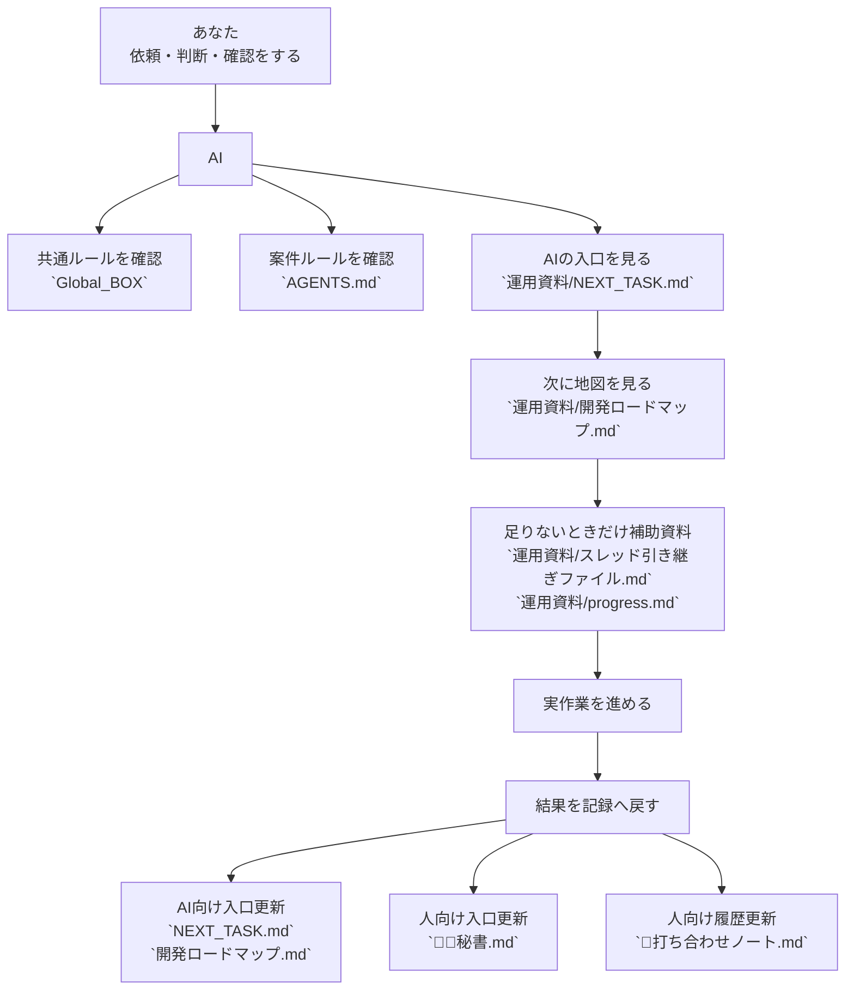
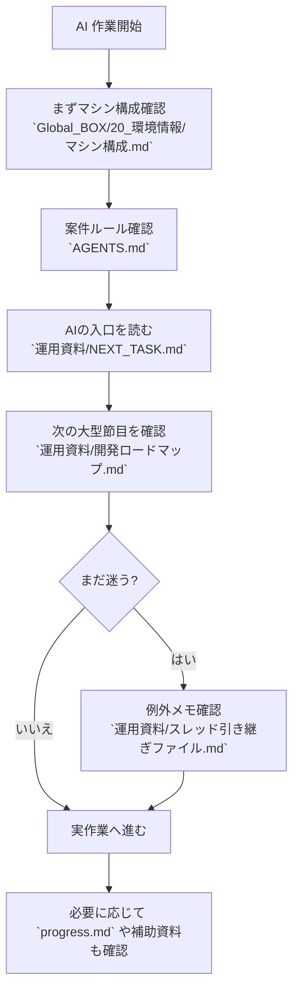
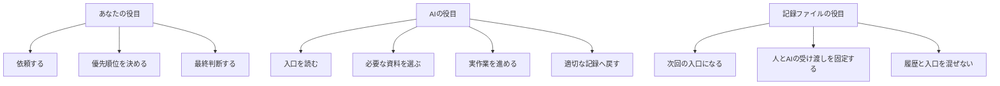
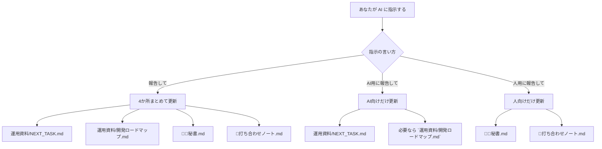
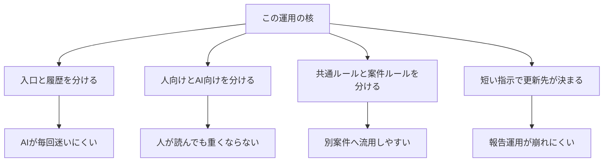

# 人とAIの記録連携フロー Obsidian用

更新日: 2026-03-30 JST

この資料は、コードではなく、`あなたと AI がどうやって記録を受け渡しながら作業しているか` を図にしたものです。
対象は次の流れです。

- `Global_BOX` が持つ共通ルール
- 案件フォルダが持つ案件固有の入口
- Obsidian 側の人向けメモ
- `報告して` `AI用に報告して` `人用に報告して` の更新分岐

## 1. まず全体像



## 2. 記録の役割分担

```mermaid
flowchart LR
    A["`Global_BOX`"] --> A1["共通ルールの正本"]
    A --> A2["マシン構成の正本"]
    A --> A3["共通環境運用の正本"]

    B["案件フォルダ"] --> B1["`AGENTS.md`<br>案件ルール"]
    B --> B2["`運用資料/NEXT_TASK.md`<br>AIの今日の入口"]
    B --> B3["`運用資料/開発ロードマップ.md`<br>AIの地図"]
    B --> B4["`運用資料/progress.md`<br>実施履歴"]
    B --> B5["`運用資料/スレッド引き継ぎファイル.md`<br>例外時メモ"]

    C["Obsidian 側"] --> C1["`👩‍⚖️秘書.md`<br>人の入口"]
    C --> C2["`📒打ち合わせノート.md`<br>人の履歴正本"]
    C --> C3["`進行状況/`<br>補助置き場"]
```

## 3. AIが毎回どう入るか



## 4. 人とAIの役割の違い



## 5. どのファイルを誰が主に見るか

```mermaid
flowchart LR
    A["AI が主に見る"] --> A1["`運用資料/NEXT_TASK.md`"]
    A --> A2["`運用資料/開発ロードマップ.md`"]
    A --> A3["必要時だけ `スレッド引き継ぎファイル.md`"]
    A --> A4["実施履歴が必要な時だけ `progress.md`"]

    B["人が主に見る"] --> B1["`👩‍⚖️秘書.md`"]
    B --> B2["`📒打ち合わせノート.md`"]
    B --> B3["必要時だけ案件の README や補助資料"]

    C["共通の土台"] --> C1["`Global_BOX` の共通ルール"]
    C --> C2["`AGENTS.md` の案件ルール"]
```

## 6. 報告指示で何が更新されるか



## 7. 実作業のあと、どう記録へ戻すか

```mermaid
flowchart TD
    A["AI が作業完了"] --> B{"何が変わった?"}

    B -->|次の判断が変わった| C["`NEXT_TASK.md` 更新"]
    B -->|フェーズや大型節目が変わった| D["`開発ロードマップ.md` 更新"]
    B -->|人に見せる価値のある変化| E["`👩‍⚖️秘書.md` 更新"]
    B -->|作業がひとまとまり終わった| F["`📒打ち合わせノート.md` 更新"]
    B -->|実施事実を残したい| G["`progress.md` 更新"]
    B -->|例外的で次のAIが迷いそう| H["`スレッド引き継ぎファイル.md` 更新"]
```

## 8. この仕組みの重要ポイント



## 9. 一言でまとめると

```text
Global_BOX が土台のルールを持つ
→ 案件フォルダがその案件の入口を持つ
→ AI はまず AI 用入口から入る
→ 人は秘書メモから入る
→ 作業後は「誰向けの記録か」に応じて戻し先を分ける
```

## 10. ファイルごとの超短い意味

- `Global_BOX`
  - 全案件共通の土台ルール
- `AGENTS.md`
  - その案件での運用ルール
- `運用資料/NEXT_TASK.md`
  - AI の今日の入口
- `運用資料/開発ロードマップ.md`
  - AI の地図
- `運用資料/progress.md`
  - 実施履歴
- `運用資料/スレッド引き継ぎファイル.md`
  - 例外時だけの圧縮メモ
- `👩‍⚖️秘書.md`
  - 人の入口
- `📒打ち合わせノート.md`
  - 人の履歴正本
