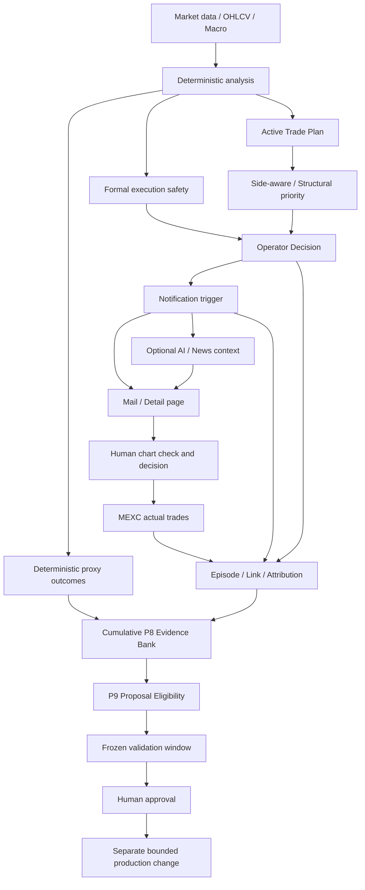

> [!abstract]
> BTC Monitorは、初期のPhase1・formal execution中心の設計から、Active Trade Plan、side-aware MTF、structural priority、`operator_decision.v1`、attention通知、actual trade import/link、P5 classifier v4、P8 operating cycle、Macro構造、任意のnews contextへ大きく進化している。
>
> 一方、P計画の進捗判定、P8日次評価、P9 readiness、`no_trade_flags`の意味、actual evidenceの数え方、正本ドキュメントには旧世代の前提が残り、最新システムの実用性を正しく評価できていない。
>
> 本計画は、**通知の有用性・正式実行の安全性・actual ground truth・累積証拠・P9提案資格を分離し、現在の資産を一つの整合した運用体系へ再接続する**ための段階的な再調整計画である。
>
> 本計画自体は実装、gate緩和、threshold変更、classifier変更、P9開始、runtime操作、通知挙動変更、注文を行わない。すべてのproduction変更は、証拠生成と人間承認の後に別TASKで行う。

## 📋 目次

- [1. 結論](#1-結論)
- [2. 確認した最新基準](#2-確認した最新基準)
- [3. 世代間の矛盾一覧](#3-世代間の矛盾一覧)
- [4. 再調整後の権限モデル](#4-再調整後の権限モデル)
- [5. 目標アーキテクチャ](#5-目標アーキテクチャ)
- [6. P1〜P9の再定義](#6-p1p9の再定義)
- [7. 現在の全資産を連動させる方法](#7-現在の全資産を連動させる方法)
- [8. 共通世代・意味契約](#8-共通世代意味契約)
- [9. P8日次チェックの再設計](#9-p8日次チェックの再設計)
- [10. 通知有用性とactual trade評価](#10-通知有用性とactual-trade評価)
- [11. P9 readiness v2](#11-p9-readiness-v2)
- [12. Phase1・formal execution gateの扱い](#12-phase1formal-execution-gateの扱い)
- [13. 正本ドキュメントと意思決定の整理](#13-正本ドキュメントと意思決定の整理)
- [14. 実施パッケージ](#14-実施パッケージ)
- [15. 検証計画](#15-検証計画)
- [16. 移行と互換性](#16-移行と互換性)
- [17. 人間承認ポイント](#17-人間承認ポイント)
- [18. リスクと停止条件](#18-リスクと停止条件)
- [19. 完了条件](#19-完了条件)
- [20. 最初に実施する最小構成](#20-最初に実施する最小構成)
- [21. 参照した主要資産](#21-参照した主要資産)

---

## 1. 結論

### 1.1 現在のシステム評価

現在のBTC Monitorは、古いP計画が想定していた状態より大幅に進んでいる。

特に次は実用段階へ到達している。

- 4H・1H・15mのdeterministic分析
- Active Trade Plan
- Long / Shortを分離したside-aware判定
- structural priority
- 反転競合をfail-closedする`operator_decision.v1`
- main / attention / followup / expiryを含む通知
- 実際のMEXC取引履歴のimport
- actual episodeとsignal link
- P5 classifier v4
- P8日次cycleとOHLCV freshness検証
- Macro構造の独立runtimeとoperator surface
- deterministic通知確定後だけ利用する任意news context

したがって、問題は「システムが未完成」なのではなく、**評価・進捗管理・証拠集計の一部が旧世代のまま残っていること**である。

### 1.2 直すべき中心点

| 対象 | 現状 | 再調整方針 |
|---|---|---|
| P8 daily cycle | 日次健康診断とP9 readinessが混在 | 日次健康診断と累積証拠を分離 |
| P9 readiness | 約5日windowへ累積条件を要求 | versioned cumulative evidenceを正本化 |
| practical readiness | `ready=False`固定 | frozen validation windowから実計算 |
| 通知評価 | formal executionに近いほど有効と解釈 | chart-check / attention / managementの有用性を独立評価 |
| actual evidence | 149 episodeが日次では2件に圧縮 | 全期間coverageと日次deltaを別表示 |
| `no_trade_flags` | moduleごとに意味が異なる | hard / advisory / unknownを共通契約化 |
| Phase1 | watchをinactive扱い | formal laneとして残し、通知有用性とは分離 |
| 正本docs | 7月21日前後の古いblockerが残存 | current truthと履歴を分離しsupersede |
| active specs | implementation済みでもpending表記 | lifecycleを実体に同期 |

### 1.3 最重要判断

> [!warning]
> formal execution gateを直ちに緩めることが最初の作業ではない。
>
> まず、**「通知が人間に有用だった」ことと「機械が正式実行を許可した」ことを別の事実として記録できるようにする**。
> その証拠を作った後にだけ、Phase1やformal gateを変更する必要が本当にあるかを人間が判断する。

### 1.4 P9について

現在のP9は、待っていれば自然に到達する設計ではない。

- initial readinessは、日次の短いwindow内に`resolved >= 100`、`actual entry >= 30`、A/B/C/STOP全種類などを同時要求する。
- practical readinessはコード上で`ready=False`に固定されている。

したがって、P9へ進めないのは証拠不足だけではなく、**readiness実装が現在の運用モデルに適合していないため**である。

---

## 2. 確認した最新基準

### 2.1 リポジトリ基準

| 項目 | 確認値 |
|---|---|
| primary repo | `/Users/marupro/CODEX/100_MCP_Server/btc_monitor` |
| branch | `Ver04-v5` |
| HEAD | `12e99d1183863d86668699f77e258ca76c88eb3b` |
| HEAD要旨 | `chore: start Ver04-v5 development line` |
| tree | unrelatedな既存dirty変更・生成物が多数存在 |
| 本計画の変更 | 新規Markdown 1件のみ |

実装時は既存dirty変更を整理、reset、restore、stash、cleanしない。対象ファイルだけを明示的に編集・stageする。

### 2.2 最新の実装世代

| 領域 | 現在の世代・状態 |
|---|---|
| P5 classifier | `manual_operator_classifier.v4` |
| no-trade semantics | hard=`volatile_regime`、9種類のadvisory token、unknownはfail-closed |
| operator surface | `operator_decision.v1`がmainへ接続済み |
| operator decision順序 | Active Plan → side-aware → structural → operator decision → notify |
| reversal safety | 7月25日の複数commitでfail-closed化済み |
| news context | notify確定後・AI advice前の任意補助経路として実装済み |
| actual trade inputs | episode 149、link 149 |
| accepted linked coverage | 96 linked rowsの存在が既存specで確認済み |
| latest normal P8 manifest | 2026-07-24、OHLCV valid、全主要stage成功 |
| latest daily actual eligible | 2 unique medium-confidence episodes |
| latest P8 class | selected trial factsは`C_WATCH_ZONE=43` |
| latest queue | 110件。actual link要確認91、人間意図確認19 |

### 2.3 P8/P9現行コード

現行`manual_operator_trial_evidence.py`のinitial readinessは次を同時要求する。

```text
resolved events >= 100
actual entry episodes >= 30
A_FORMAL / B_CHECK_15M / C_WATCH_ZONE / STOP_OR_EXITがすべて存在
Long / Shortが両方存在
regime segmentationが存在
setup segmentationが存在
```

practical readinessは次で固定されている。

```text
validation_window_status = not_established
ready = false
```

### 2.4 production execution lane

現行formal execution gateは次を要求する。

```text
phase1_active = true
primary_setup_status = ready
data_quality = ok
no_trade_flags = empty
execution shadow > 20
wait shadow < 60
```

`activation.py`では`watch`は`phase1_active=False / watch_reference_only`である。

最新の`trades.csv`から確認した20件は、すべて`trade_execution_gate=blocked`だった。主なblockerは次である。

- `phase1_inactive`
- `setup_not_ready`
- `no_trade_flags_present`
- 一部で`execution_shadow_too_low`
- 一部で`wait_pressure_too_high`

同じ行の多くは、`B_CHECK_15M`、`C_WATCH_ZONE`、attention、bias変化、confidence変化として通知・監視価値を持っている。

---

## 3. 世代間の矛盾一覧

### 3.1 確認済みの主要矛盾

| ID | 古い前提・条件 | 現在の事実 | 問題 | 対応 |
|---|---|---|---|---|
| GAP-01 | MEXC完全batchがなくactual=0 | import済み、episode/link各149 | P計画のblocker表示が誤り | canonical docsを更新し旧決定をsupersede |
| GAP-02 | daily P8だけでP9 readinessを判断 | dailyは499本の15m足、約5日window | 30 actual / 100 resolvedを日次内で要求し非現実的 | cumulative evidence bankを新設 |
| GAP-03 | practical readinessは将来自然にtrue | `ready=False`固定 | 永久に到達不能 | frozen validation windowで計算するv2へ移行 |
| GAP-04 | A/B/C/STOP全種類が常時必要 | v4ではwindowによりSTOPやAが正当に0 | 分布改善がreadiness失敗になる | claim-relevant segmentationへ変更 |
| GAP-05 | non-empty no-tradeはすべてSTOP/block | classifier v4はadvisoryを区別 | offlineとproductionで意味が不一致 | 共通semantic registryを作る |
| GAP-06 | Phase1 readinessが通知価値の代理 | 実際の有用メールはB/C/attention中心 | 人間に有用な通知を失敗扱い | usefulness laneを独立 |
| GAP-07 | actual 149のうち2件だけ有効 | 2件は日次selected factに残った件数 | 全期間coverageと日次coverageが混同 | full-period attributionとdaily deltaを分離 |
| GAP-08 | review queue 110は新しい異常110件 | 91件は既存低信頼/曖昧linkのbacklog | 毎日同じbacklogが異常に見える | backlog / new / resolvedを分離 |
| GAP-09 | classifier前日差は同一母集団 | 7/22 v1、7/24 v4 | version changeを性能変化と誤認 | version cohortとbaseline reset |
| GAP-10 | ISSUE-001=0は解決 | v4でSTOP母集団が0 | 検出不能と解決を混同 | `not_applicable_no_stop_population`を追加 |
| GAP-11 | linkerの`entry_like/defensive`が現行通知を表す | 現在はmain/attention/followup/expiry、operator decisionがある | actual attributionが粗い | modern notification taxonomyへ更新 |
| GAP-12 | active specはimplementation pending | operator decision・news contextは実装済み | planning lifecycleが実体と不一致 | accepted結果を確認しarchiveへ移動 |
| GAP-13 | DEC-20260721-012のblockerを再調査しない | batch出現、source変更、ユーザー明示依頼が成立 | no-repeat boundaryの再開条件を満たす | 新decisionでsupersede |
| GAP-14 | MASTER_PLAN内の複数overrideが共存 | M・Pの状態が後段で上書き | 読み手が正本を特定できない | volatile stateをCURRENT_STATEへ移す |
| GAP-15 | primary repoとfrozen repoが同じpath表記 | 境界として成立していない | runtime安全指示が曖昧 | 実pathを再確認し明記、未確定なら削除 |
| GAP-16 | `AFROG_Business_MCP`表記 | 現在の標準は`AFROG_MCP` | 運用名称が不一致 | canonical docsを統一 |
| GAP-17 | P9という名称が単一 | P-route P9とMacro側proposal資産にP9名が混在 | phaseの意味を取り違える | `program=P/M`とphase namespaceを必須化 |
| GAP-18 | news/AI判断が主判断に見える可能性 | newsはnotify後の補助、operator decisionが上位 | 説明系が権限超過し得る | authority metadataと不変test |

### 3.2 未確認部分の扱い

今回の調査では、正本ドキュメント、active specs、P5/P8/P9、notification、actual link、Phase1、operator decision、main integrationを優先確認した。

全repoの全履歴ファイルを正本として再解釈することは行わない。実装の最初に、現行コードとcanonical docsを対象とした機械的なcontract inventoryを作り、残る矛盾を追加検出する。

> [!info]
> archiveは履歴として保存するが、現行判断の入力にはしない。archive内の古い条件を一括置換する作業は行わない。

---

## 4. 再調整後の権限モデル

### 4.1 一つの値に全責任を持たせない

現在の資産は、それぞれ異なる目的で有効である。再調整後は権限を次のように固定する。

| レイヤー | 正本 | 責任 | 責任を持たないもの |
|---|---|---|---|
| 市場事実 | OHLCV・market data・Macro snapshot | 入力事実とfreshness | 売買許可 |
| 機械方向評価 | score・Market Map・MTF | 方向・構造・競合 | 最終行動 |
| 戦術計画 | Active Trade Plan | entry候補、zone、invalidation | 自動実行許可 |
| 人間向け現在判断 | `operator_decision.v1` | 今見るべき側、blocked/conflict/check/watch | 注文実行 |
| formal execution safety | `trade_execution_gate` | formal candidateの保守的許可 | 通知の有用性 |
| learning opportunity | observation / phase1b / opportunity gates | paper・観察対象 | FORMAL_GO |
| notification delivery | `should_notify()` | main/attention/followupの送信判断 | trade permission |
| qualitative context | AI advice・news | 説明、警告、確認事項 | deterministic値の変更 |
| offline operator taxonomy | P5 classifier | A/B/C/STOPのhistorical分類 | production gate |
| actual ground truth | MEXC episode/link | 実際の行動と結果 | 通知が原因だったという断定 |
| daily health | P8 daily cycle | 実行、freshness、lineage、delta | 累積P9判定 |
| cumulative evidence | P8 evidence bank v2 | 長期coverageとsegment evidence | 自動tuning |
| proposal lifecycle | P9 v2 | proposal資格、validation、human approval | 自動採用 |

### 4.2 強制する優先順位

```text
market/data validity
→ deterministic analysis
→ formal safety constraints
→ operator_decision
→ notification delivery
→ AI/news explanation
→ human decision
```

AI、news、P5 offline classifier、Macro補助レイヤーは、formal safetyとoperator decisionを上書きしない。

### 4.3 「blockedだが有用」を正式な状態にする

次は矛盾ではなく、現在のプロダクトの主要ユースケースである。

```text
formal_execution = blocked
operator_decision = check_15m / watch_zone / conditional_candidate
notification = attention or main
human_action = chart checked / manual entry / no entry / management
```

この状態を「正式実行に失敗した通知」ではなく、**human-decision supportとして評価可能な通知**として記録する。

---

## 5. 目標アーキテクチャ



### 5.1 二つの時間軸

| 時間軸 | 目的 | 保存 |
|---|---|---|
| rolling daily | runtime健康、freshness、直近delta | date-specific P8 cycle |
| cumulative versioned | 長期有用性、actual coverage、P9証拠 | immutable evidence bank |

日次windowの減少・増加と、累積証拠の増加を同じ指標で扱わない。

### 5.2 二つの結果

| 結果 | 内容 |
|---|---|
| proxy outcome | 通知・候補後の市場がどう動いたか |
| actual outcome | 人間が実際に何を行い、どの結果だったか |

両者を別々に保持し、合算win rateや通知因果を自動で作らない。

---

## 6. P1〜P9の再定義

### 6.1 進捗表

| Phase | 本来の目的 | 現在の状態 | 再調整後の扱い |
|---|---|---|---|
| P1 | actual export import | 完了・最新MEXC形式対応済み | accepted。input schema/version監視を継続 |
| P2 | position/tradeをepisode化 | 149 episode生成済み | accepted。重複・close status・idempotencyを維持 |
| P3 | episodeとsignalをlink | 149 link、linked coverageあり | accepted-v2。現行通知taxonomy対応をv3候補として調査 |
| P4 | scenarioとoutcomeを正規化 | deterministic pipeline稼働 | accepted。future leakage防止を維持 |
| P5 | offline operator分類 | classifier v4へ進化 | accepted-v4。共通semantic registryへ接続 |
| P6 | historical replay/comparison | proxy・actual join経路あり | accepted。現行operator fieldsとversion cohortを追加 |
| P7 | human operator surface | side-aware、structural、operator decision、news補助 | 実質完成度が高い。active spec lifecycleを整理 |
| P8 | human trial evidence | daily cycle・actual取込は稼働 | daily healthとcumulative evidenceへ分割 |
| P9 | evidence-backed proposal | readiness実装が旧世代 | v2へ再設計。proposalとproduction adoptionを分離 |

### 6.2 P1〜P7は作り直さない

P1〜P7を一括再実装しない。既存資産を捨てず、次を追加する。

- generation/version metadata
- 共通意味契約
- lineage
- authority owner
- cumulative evidenceへの接続

### 6.3 P8の新しい定義

```text
P8-A: Daily Operational Health
P8-B: Cumulative Deterministic Evidence
P8-C: Actual Trade Attribution
P8-D: Human Intent Exceptions
```

### 6.4 P9の新しい定義

```text
P9-A: Issue-specific proposal eligibility
P9-B: Frozen validation
P9-C: Human approval
P9-D: Bounded implementation
P9-E: Shadow acceptance
P9-F: Separate production adoption
```

P9-Aへ到達しても、P9-Dやproduction変更を自動開始しない。

---

## 7. 現在の全資産を連動させる方法

### 7.1 Live通知資産

| 資産 | Evidence bankへ保存する項目 |
|---|---|
| score / bias | version、Long/Short値、gap |
| Market Map | primary state、conflict、主要flag |
| setup | side、status、reason、entry/SL/TP |
| formal gate | pass/blocked、blocker |
| observation gates | gate、type、reason |
| Active Trade Plan | primary action、candidate identity、zone |
| side-aware MTF | side、class、state、reason |
| structural priority | side、strength、alignment、turning |
| operator decision | state、side、reason、blocked status |
| notification | kind、reason、sent/not sent、cooldown/suppression |
| AI/news | provider/statusだけ。deterministic evidenceと分離 |

### 7.2 Actual資産

| 資産 | 役割 |
|---|---|
| `manual_actual_trades.csv` | fill-level monetary facts |
| `manual_actual_orders.csv` | order facts |
| `manual_actual_positions.csv` | position facts |
| `manual_trade_episodes.csv` | decision-equivalent actual episode |
| `manual_trade_signal_links.csv` | signalとの候補link |
| ground truth report | actual performanceの分離集計 |

### 7.3 P8資産

| 資産 | 新しい役割 |
|---|---|
| `cycle_manifest.json` | daily healthと当日delta |
| `cycle_summary.md` | 人間向け日次要約 |
| trial facts | 日次selected fact。累積母集団そのものではない |
| review queue | new / backlog / resolvedを分ける |
| exact link observations | 記述的証拠。P9 denominatorへ自動算入しない |
| turning precursor shadow | issue-specific shadow evidence |
| macro structure shadow | P-routeへ補助contextを渡す独立lane |

### 7.4 Macro資産

Macro M-routeはP-routeの入力補助であり、P9の一括blockerにはしない。

- Macro snapshot/history/operatorは構造contextとして使用する。
- Macro側のM1〜M5、proposal engine、`macro_p9_*`という名称はP-route P9と区別する。
- manifestへ`program: M`または`program: P`を必須化する。
- Macroが不足しても、P-routeのactual attributionや通知有用性集計は継続する。
- Macroのproduction adoptionはMacro側の人間承認を別途必要とする。

### 7.5 AI・news資産

- deterministic notifyの後だけ実行する。
- evidence bankでは補助contextとしてラベル付けする。
- AIの決定文字列をactual linkの正本にしない。
- newsの方向でproxy outcomeやtrade successを補正しない。
- provider unavailableでもP8/P9 data lineageを壊さない。

---

## 8. 共通世代・意味契約

### 8.1 Generation Manifest

各signal/evidence bundleへ、最低限次を記録する。

```yaml
program: P
runtime_generation: Ver04-v5
source_head: <commit>
score_version: <version>
market_map_version: <version>
active_plan_version: <version>
side_aware_version: <version>
structural_priority_version: <version>
operator_decision_version: operator_decision.v1
notification_trigger_version: <version>
classifier_version: manual_operator_classifier.v4
replay_version: <version>
linker_version: manual_trade_signal_link.v2
p8_evidence_version: <version>
readiness_version: legacy.v1 | p9_readiness.v2
cutoff_utc: <timestamp>
```

versionが存在しない資産は、最初のinventoryで`legacy_unversioned`として明示し、暗黙に最新扱いしない。

### 8.2 No-trade Semantic Registry

共通契約は次の三分類を持つ。

| group | 意味 | 例 | 既定挙動 |
|---|---|---|---|
| hard blocker | formal実行と該当offline classを止める | `volatile_regime` | fail-closed |
| advisory/watch | chart-check・wait・invalidation監視 | breakout/watch/wait-only系 | formal permissionとは別に評価 |
| unknown | 未定義token | 任意の未知値 | fail-closed + issue |

重要なのは、同じregistryを参照しても、各laneの権限は同じにしないことである。

- formal execution gateは保守的なままでもよい。
- P5はadvisoryからB/Cを評価できる。
- operator decisionはwatch/checkを表示できる。
- notification triggerはattentionを送れる。
- evidence bankは「blockedだが有用」を記録できる。

### 8.3 Authority Metadata

主要payloadへ次を持たせる。

```text
authority_scope = display | formal_execution | notification | offline_evaluation | qualitative_only
can_mutate_order = false
can_mutate_notification = true/false
can_mutate_gate = false
```

少なくともtest fixtureでは、news、AI、P5、Macro補助がformal gateを変更しないことを固定する。

### 8.4 Version cohort

異なるclassifier versionを同じ分布として比較しない。

```text
v1 cohort
v2 cohort
v3 cohort
v4 cohort
```

version変更日には次を出す。

```text
comparison_status = baseline_reset_required
performance_delta = not_comparable
```

必要なら同一固定入力を旧/新versionで再生したmigration comparisonを別途作る。

---

## 9. P8日次チェックの再設計

### 9.1 残すもの

現在のdaily cycleで有効な機能は維持する。

- 11:30 JST実行記録
- last result
- success / failed / actual_pair_incomplete
- output manifestとsummaryの存在・freshness
- OHLCV freshness
- stage status
- candidate / resolved / unresolved / no-OHLCV
- input/output fingerprints
- actual pair completeness
- safety boundary

### 9.2 daily manifest v2の区分

```json
{
  "operational_health": {},
  "rolling_window": {},
  "generation": {},
  "daily_delta": {},
  "actual_attribution_delta": {},
  "review_queue": {},
  "cumulative_evidence_pointer": {},
  "legacy_readiness_v1": {},
  "p9_readiness_v2": {}
}
```

### 9.3 通知すべき異常

必須通知:

- 当日実行なし
- failed / actual_pair_incomplete
- manifest欠落・古い
- OHLCV invalid
- stage failure
- fingerprint/identity conflict
- generation metadata欠落
- cumulative pointer更新失敗
- 新規high/medium actual linkが失われた
- unknown semantic token出現
- version変更なのにbaseline resetされない

### 9.4 意味のある変化

通知候補:

- new actual linked episode
- reviewed linkのconfidence昇格・降格
- notification usefulness segmentの大幅変化
- unresolved/no-OHLCVの異常増加
- queueのnew件数増加
- P9 v2 state遷移
- 人間承認待ち項目の発生

### 9.5 通知しないもの

- backlog総数が同じまま
- rolling window入れ替わりによる通常変動
- classifier version変更を跨いだ単純なclass差
- STOP母集団がないためISSUE-001が0
- cumulative evidenceに変化がない日

### 9.6 Review Queue v2

| 指標 | 意味 |
|---|---|
| `new_items` | 当日に初めて追加 |
| `backlog_items` | 前日以前から未解決 |
| `resolved_items` | 当日解決 |
| `expired_items` | 対象外へ移動 |
| `by_question_type` | ambiguous link / human intent / data issue |
| `by_evidence_tier` | high / medium / low / ambiguous / proxy |

日次通知は`new_items`と重要な`resolved_items`を主に扱い、backlog総数だけで警報を出さない。

### 9.7 ISSUE-001状態

```text
open_with_population
observed_no_qualification
not_applicable_no_stop_population
not_comparable_generation_change
resolved_by_validation
```

`0件`と`resolved`を分離する。

---

## 10. 通知有用性とactual trade評価

### 10.1 評価対象

現行メールは「正式なエントリー指示」だけではない。以下を別segmentで評価する。

- main
- attention
- followup / management
- expiry / reevaluation
- B_CHECK_15M
- C_WATCH_ZONE
- conditional candidate
- direction conflict warning
- blocked but chart-check useful

### 10.2 Notification Usefulness Ledger

1通知または1decision-equivalent episodeにつき、次を保存する。

```text
signal_id
notification_kind
was_notified
notify_reason_codes
operator_decision_state
operator_primary_side
formal_execution_gate
formal_blockers
P5 operator class
active plan action
side-aware class/state
structural side/alignment
proxy outcome
actual episode candidate
actual link confidence
actual position side
entry latency minutes
actual realized PnL
human_basis = yes | no | unknown
causality_status = not_claimed | human_confirmed
```

### 10.3 実用的な評価区分

| category | 説明 |
|---|---|
| formal_candidate_used | formal laneとactualが一致 |
| chart_check_then_entry | formal blockedだが通知後に人間が確認してentry |
| attention_then_entry | attention通知後にentry |
| management_useful | position管理・無効化・期限切れに利用 |
| useful_no_entry_proxy | 市場上は有用そうだが人間意図不明 |
| ignored_or_unrelated | link候補はあるが根拠でない |
| ambiguous | 複数候補・低confidence |
| no_actual_action | 通知はあるがactual episodeなし |

`useful_no_entry_proxy`をactual successへ数えない。

### 10.4 Linkerの再評価

現行v2の`entry_like / defensive / followup_management / unknown`は保持しつつ、現行payloadから次を追加するv3候補をofflineで検証する。

- `notification_kind`
- `operator_decision.state`
- `operator_decision.primary_side`
- `side_aware_primary_class`
- `active_primary_action`
- `notify_reason_codes`
- `followup_for_signal_id`

既存149件を再構築し、次のreason bucketを出す。

```text
linked_high
linked_medium
linked_low
ambiguous_tie
side_conflict
symbol_conflict
no_candidate
outside_time_window
followup_only
multiple_signal_candidates
missing_modern_metadata
```

### 10.5 因果関係

自動linkは時間・方向・identityの関連を示すだけである。

```text
notification preceded actual entry
```

は記録できるが、

```text
notification caused actual entry
```

は、人間が`yes`と確認した場合だけ`human_confirmed`にする。

### 10.6 Actualとproxyを混ぜない

レポートは最低でも次の2部に分ける。

1. deterministic proxy outcome
2. actual position/episode outcome

actual PnLをproxy TP/SLへ合算しない。proxy successをactual win rateと呼ばない。

---

## 11. P9 readiness v2

### 11.1 一つのbooleanを廃止する

次の5軸へ分ける。

| 軸 | 目的 |
|---|---|
| `operational_health` | daily pipelineが正常か |
| `evidence_coverage` | 累積証拠が再現可能か |
| `notification_usefulness` | 人間支援として評価可能か |
| `proposal_eligibility` | 特定issueの変更案を作れるか |
| `adoption_readiness` | validationと人間承認が揃ったか |

### 11.2 状態値

```text
blocked_data
collecting
baseline_available
eligible_for_proposal
proposal_under_review
shadow_validating
human_approval_required
approved_for_bounded_implementation
accepted_shadow
approved_for_production
rejected
```

### 11.3 累積母集団

P9 v2はdaily 5日windowではなく、次を満たすversioned cumulative cohortを使う。

- immutable source fingerprint
- cutoff
- compatible generation
- event deduplication
- unresolved/no-OHLCV separation
- actual confidence separation
- Long/Short・regime・setup breakdown
- future leakageなし

### 11.4 全4class必須を廃止する

A/B/C/STOP全種類の存在をglobal条件にしない。

代わりに、提案対象ごとに必要なsegmentを定義する。

例:

| 提案 | 必要な証拠 |
|---|---|
| B通知改善 | Bと対応する比較対象、両sideまたはside限定宣言 |
| C watch改善 | C、watch outcome、notification burden |
| STOP緩和 | STOPとcounterfactual、hard/advisory分離 |
| precursor通知 | independent opportunity、false/opposite/lead time、validation |
| UI改善 | usability evidence。actual PnL閾値は不要 |

classが存在しない場合は、`not_observed_in_cohort`と報告し、自動失格にはしない。

### 11.5 Legacy thresholdの扱い

現在の100 resolved / 30 actual、practicalの200 / 50という基準は削除せず、当面は`legacy_readiness_v1`として表示する。

ただしv2のproduction判断には直接使わない。

v2の数値閾値は、最初のcumulative baselineで次を計測してから人間が決める。

- 月間通知数
- unique notification episode数
- actual episode頻度
- high/medium link率
- segment別独立sample数
- Long/Short偏り
- generation安定期間
- validation windowを確保できる量

> [!warning]
> 既存30/50を単に小さくするだけでは再設計にならない。
> 先に「何の変更提案を評価するための母集団か」を固定する。

### 11.6 Practical readinessを実計算する

practical readinessには次を必要とする。

- frozen validation cohortが存在
- calibrationとvalidationが時間順に分離
- versionとthresholdがvalidation前に固定
- claim-relevant segmentが存在
- actual attributionが必要なclaimではactual coverageがある
- unresolved/no-OHLCVを勝敗へ混ぜない
- human approvalが記録される

これらを満たした時だけ`human_approval_required`または次状態へ進む。`ready=False`固定は廃止する。

### 11.7 P9はissue単位

P9をプロジェクト全体の一括GOにしない。

```text
P9-PROP-NOTIFICATION-B-C
P9-PROP-STOP-SEMANTICS
P9-PROP-TURNING-PRECURSOR
P9-PROP-PHASE1-FORMAL-GATE
P9-PROP-OPERATOR-UI
```

各proposalは独立した証拠、validation、承認を持つ。

---

## 12. Phase1・formal execution gateの扱い

### 12.1 現時点の決定

formal execution gateは、証拠なしに緩めない。

理由:

- paper orderやformal candidateと接続されている。
- account balance・position sizing・exit planを伴う。
- `no_trade_flags`の一括blockは古いが、安全側に倒れている。
- 人間が通知からentryしている事実だけでは、formal automationへ昇格する根拠にならない。

### 12.2 先に行うこと

1. formal blocked通知の有用性を独立集計する。
2. blockerごとのactual/proxy分布を出す。
3. advisory tokenだけでblockedになった群を分離する。
4. `watch`群の人間行動と結果を記述する。
5. data quality、hard blocker、unknown tokenを除外する。
6. offline counterfactualを作る。
7. human-approved proposalを作る。

### 12.3 将来の選択肢

証拠を見た後、次のいずれかを選ぶ。

| 選択肢 | 内容 | 負担・安全性 |
|---|---|---|
| A | formal gateは現状維持。usefulness評価だけ修正 | 最小・最安全 |
| B | `human_actionable`または`chart_check_candidate`を正式な別laneにする | 実用性を正しく表現 |
| C | advisory tokenをformal gateでも個別解釈 | 高リスク。十分なvalidation必須 |
| D | Phase1をretire/renameし新formal contractへ移行 | 大規模。別計画が必要 |

本計画の第一推奨はA+Bである。C/Dは証拠後に別承認とする。

### 12.4 命名

`A_FORMAL`は`FORMAL_GO`ではないという既存安全境界を維持する。

必要なら将来、誤解を避けるため次へ改名するproposalを作る。

```text
A_FORMAL_CONDITION_MET
B_CHECK_15M
C_WATCH_ZONE
STOP_OR_EXIT
```

改名はschema migrationを伴うため、今回の初期TASKでは行わない。

---

## 13. 正本ドキュメントと意思決定の整理

### 13.1 正本の責任

| file | 正本とする内容 |
|---|---|
| `MASTER_PLAN.md` | P/Mプログラムの不変構造・目的・phase定義 |
| `PRODUCT_IMPLEMENTATION_ROUTE.md` | product use-caseとoperator journey |
| `CURRENT_STATE.md` | 現在のbranch/HEAD/runtime/evidenceの事実 |
| `NEXT_ACTION.md` | 現在認可された次の1パッケージ |
| `DECISIONS.md` | append-only decisionとsupersedes chain |
| `MILESTONES.md` | accepted milestoneの状態 |
| `P8_P9_ISSUE_REGISTER.md` | issue単位の証拠・状態 |
| `START_HERE.md` | 読む順序とAFROG_MCP導線 |
| active spec | 実装・検証が未完の作業だけ |
| archive spec | 完了・却下・supersededの履歴 |

### 13.2 必須修正

- private MEXC batch missingという記述をcurrent blockerから除外する。
- actual episode/link 149と現行coverageを反映する。
- DEC-20260721-012を、新しいdecisionでsupersedeする。
- P8 dailyとP9 cumulativeを分離する。
- practical readiness固定falseを既知設計欠陥として記録する。
- `AFROG_Business_MCP`を`AFROG_MCP`へ統一する。
- primary/frozen repoが同一pathになっている記述を修正する。
- `Ver04-v5`とHEADをcurrent stateへ反映する。
- operator decision/news実装済みspecを検証後archiveへ移す。
- branch開始だけでspecの`implementation-pending`を維持しない。
- MASTER_PLAN内の古いoverride sectionを履歴へ移す。

### 13.3 Decision chain

新decision例:

```text
DEC-20260725-P-ALIGN-001
supersedes: DEC-20260721-012 for current blocker/readiness interpretation
```

内容:

- actual batchは出現済み。
- P8 recoveryは完了済み。
- P9 blockerはactual欠落ではなく、generation-alignmentとreadiness modelに移った。
- daily healthは継続。
- P9 v2実装まではlegacy readinessを参考表示に限定。
- production変更は別human approval。

### 13.4 Stale detection

canonical docsへ次のmetadataを追加する。

```yaml
last_verified_at: <timestamp>
verified_branch: Ver04-v5
verified_head: <commit>
status_source: CURRENT_STATE.md
supersedes: <decision id>
```

active specが実装commitより古い`implementation-pending`のままなら、docs testをfailさせる仕組みを検討する。

---

## 14. 実施パッケージ

### 14.1 全体順序

| Package | 目的 | production挙動変更 |
|---|---|---|
| WP0 | contract inventory | なし |
| WP1 | canonical docs再整合 | なし |
| WP2 | shared semantics・generation metadata | なし。出力同値を必須 |
| WP3 | cumulative evidence bank | なし |
| WP4 | modern actual attribution/usefulness | なし |
| WP5 | P8 daily manifest v2 | 通知挙動は変更しない |
| WP6 | P9 readiness v2 shadow | なし。legacy併記 |
| WP7 | evidence reviewとproposal作成 | なし |
| WP8 | 承認済み変更のbounded実装 | 別承認時のみ |

### 14.2 WP0 — 現行Contract Inventory

**目的:** 現行コードから、decision field、owner、version、consumer、権限を一覧化する。

対象:

- score / confidence
- Market Map
- setup
- Phase1
- formal execution
- observation / phase1b / opportunity
- Active Trade Plan
- side-aware
- structural priority
- operator decision
- notification trigger
- AI/news
- P5/P6/P8/P9
- Macro input

成果物候補:

```text
docs/operations/ai-orchestration/P_SYSTEM_CONTRACT_MAP.md
local/reports/p_alignment/contract_inventory.json
```

Acceptance:

- fieldごとにsingle ownerがある。
- display authorityとformal authorityを区別する。
- versionなしを`legacy_unversioned`として列挙する。
- duplicate semanticが一覧化される。
- source editなし。

### 14.3 WP1 — Canonical Truth Reconciliation

**目的:** P計画の正本を2026-07-25の実体へ更新する。

対象docs:

- `START_HERE.md`
- `MASTER_PLAN.md`
- `PRODUCT_IMPLEMENTATION_ROUTE.md`
- `CURRENT_STATE.md`
- `NEXT_ACTION.md`
- `DECISIONS.md`
- `MILESTONES.md`
- `P8_P9_ISSUE_REGISTER.md`
- `AGENTS.md` / `CONTROL.md`のpath・名称矛盾
- active spec lifecycle

Acceptance:

- current blockerがactual batch missingではない。
- P8/P9の新定義が一貫する。
- DEC supersedes chainが明記される。
- activeは未完作業だけになる。
- archiveは変更履歴として保持される。
- runtime/source変更なし。

### 14.4 WP2 — Shared Semantics and Generation Contract

**目的:** hard/advisory/unknown tokenとauthority metadataを共通化する。

候補実装:

```text
src/contracts/operator_semantics.py
```

最終pathは近接構造を確認して決める。

接続候補:

- `manual_operator_classifier.py`
- `execution_gate.py`
- `opportunity_gate.py`
- `operator_decision.py`
- P8 evidence report

初回の制約:

- execution gateのpass/blockedを変えない。
- classifier v4の固定fixture出力を変えない。
- notification結果を変えない。
- shared functionへ置換するだけで同値を証明する。

Acceptance:

- token定義の重複がなくなる。
- unknown tokenは全laneで可視化される。
- formal/advisoryの意味がreportへ残る。
- existing outputsのgolden parityが通る。

### 14.5 WP3 — Cumulative P8 Evidence Bank

**目的:** daily windowから独立した、versioned・deduplicatedな累積証拠を作る。

入力:

- `trades.csv`
- active plan candidates
- signal outcomes
- P4 scenarios/events
- P5 classifications
- actual episodes/links
- exact observations
- decision events

出力候補:

```text
local/reports/p_evidence/latest/evidence_manifest.json
local/reports/p_evidence/latest/evidence_facts.csv
local/reports/p_evidence/latest/evidence_summary.md
local/reports/p_evidence/history/<run_id>/...
```

Acceptance:

- rerun deterministic。
- event/episode重複なし。
- proxy/actual分離。
- version cohort分離。
- daily window外のactualもcoverageに残る。
- source fingerprintsとcutoffを保存。
- private raw exportをreportへ露出しない。

### 14.6 WP4 — Modern Actual Attribution and Usefulness Report

**目的:** 149 episode/linkを現在の通知・operator decision世代で再評価する。

実施:

1. v2 linkを変更せずbaselineとして保存。
2. modern metadataのcoverageを測る。
3. v3候補linkをoffline生成。
4. v2/v3の差をreason bucketで比較。
5. high/medium/low/ambiguousを分離。
6. human basisを必要な例外だけqueue化。
7. notification usefulness reportを生成。

Acceptance:

- 149→linked/high/medium/low/ambiguous/no-candidateの流れを説明できる。
- 2 daily eligibleとfull-period coverageを区別できる。
- notification kind・operator state別に集計できる。
- actual PnLとproxy outcomeを混ぜない。
- causalityを自動主張しない。
- canonical linkを自動置換しない。

### 14.7 WP5 — P8 Daily Manifest v2

**目的:** daily cycleを健康診断とdelta通知へ最適化する。

追加:

- generation section
- daily queue delta
- actual attribution delta
- cumulative evidence pointer
- comparison status
- baseline reset reason
- ISSUE applicability
- legacy/v2 readinessの分離

Acceptance:

- 既存failure detectionを維持。
- v1/v4を単純比較しない。
- backlogだけで異常通知しない。
- new actual evidenceを通知できる。
- notification behaviorそのものは変更しない。
- 既存schedule/runtimeを変更しない。

### 14.8 WP6 — P9 Readiness v2 Shadow

**目的:** v1を壊さず、新readinessを並行生成する。

出力:

```text
legacy_readiness_v1
p9_readiness_v2
```

v2はstate、dimensions、missing requirements、claim scopeを返す。

Acceptance:

- practicalが固定falseではない。
- daily windowだけで判定しない。
- class全種類をglobal必須にしない。
- frozen validation未設定なら`collecting`または`baseline_available`。
- human approvalなしにproduction stateへ進まない。
- v1とv2の差を説明するmigration reportがある。

### 14.9 WP7 — Evidence Review and Proposal Selection

**目的:** 証拠から、実際に変更すべきissueを選ぶ。

候補:

- formal blockedだがB/C/attentionが有用
- advisory tokenのformal gate扱い
- Phase1 watch lane
- notification trigger burden
- actual linker confidence
- turning precursor
- operator UI

成果物は変更案であり、source editではない。

各proposalに必須:

- claim
- cohort
- current behavior
- proposed behavior
- expected benefit
- safety risk
- offline result
- frozen validation plan
- rollback
- human decision

### 14.10 WP8 — Bounded Implementation and Adoption

WP7で承認されたproposalだけを実装する。

- 1 proposal = 1 change class
- classifier、gate、threshold、notificationを同じTASKで混ぜない
- shadow validationを先に行う
- production applyは別明示承認
- runtime・launchd・mail変更はさらに分離

---

## 15. 検証計画

### 15.1 全Package共通

- `git status`は開始時と終了時に必要最小限だけ確認する。
- unrelated dirty fileを変更しない。
- targeted testsをTASK末尾に集約する。
- full suiteはshared helper変更で必要性が証明された時だけ行う。
- 実メール、実注文、実口座、runtime reloadを行わない。
- outputはlocal/report-only。

### 15.2 Contract tests

必須test:

1. authority precedence
2. AI/news cannot mutate deterministic fields
3. P5 cannot authorize order
4. formal gate cannot be inferred from notification kind
5. unknown semantic token fails closed
6. advisory semantic remains visible
7. generation metadata completeness
8. version cohort comparison reset

### 15.3 Evidence tests

1. future context rejection
2. cutoff enforcement
3. duplicate event exclusion
4. duplicate episode exclusion
5. proxy/actual separation
6. unresolved/no-OHLCV separation
7. high/medium policy enforcement
8. human-confirmed causality separation
9. deterministic rerun hashes
10. atomic output replacement

### 15.4 P8 tests

1. missing/failed/actual_pair_incomplete通知
2. stale manifest
3. invalid OHLCV
4. version change baseline reset
5. queue new/backlog/resolved
6. actual link delta
7. no meaningful deltaなら通知なし
8. ISSUE no-population state

### 15.5 P9 v2 tests

1. cumulative cohortを使用
2. daily count減少でreadinessが逆戻りしない
3. incompatible generationを混ぜない
4. claim-specific class coverage
5. validation window未設定
6. frozen validation成立
7. human approval required
8. automatic production transitionなし

### 15.6 Historical rebuild

固定入力で最低限次を作る。

- classifier v1 baseline
- classifier v4 baseline
- current notification/operator baseline
- actual link v2 baseline
- modern attribution candidate
- P9 legacy/v2 comparison

既存canonical CSVを上書きせず、local outputへ保存する。

---

## 16. 移行と互換性

### 16.1 Dual reporting

移行中は次を併記する。

```text
legacy_readiness_v1
p9_readiness_v2
```

legacy v1を即削除しない。v2のdeterminismと意味が確認された後に、human decisionでdeprecated化する。

### 16.2 Baseline

- classifier v4の最初の安定cohortを新baselineにする。
- v1以前との比較はmigration reportだけで行う。
- `Ver04-v5`開始以降のgenerationを明示する。
- source HEADが変わってもbehavior generationが同じなら別metadataとして保持する。

### 16.3 Daily continuity

P8 dailyのscheduleとfail-closed動作は維持する。

v2追加が失敗しても、既存health結果を壊さない設計とする。

### 16.4 Cumulative rebuild

- 初回はfull rebuild。
- 以降はdelta-only更新。
- fingerprint不一致時はsilent mergeしない。
- rebuild可能性を維持する。
- latest pointerとimmutable historyを分離する。

### 16.5 Review queue移行

既存91件のambiguous/low actual linkはbacklogとしてimportする。

初回v2の日に91件すべてを`new`扱いしない。

---

## 17. 人間承認ポイント

| Checkpoint | 人間が決めること | 自動化禁止事項 |
|---|---|---|
| H1 | 共通semantic/authority contract | gate意味変更 |
| H2 | cumulative baselineの採用 | legacy閾値の自動置換 |
| H3 | P9 v2のclaim別閾値 | proposal自動開始 |
| H4 | formal gate/Phase1を変更するか | advisoryの自動許可 |
| H5 | notification trigger変更 | 通知量の自動調整 |
| H6 | classifier/threshold proposal | production自動反映 |
| H7 | runtime/launchd/mail apply | live操作 |
| H8 | FORMAL_GOまたは自動注文 | 本計画の範囲外 |

### 17.1 H4で必要な資料

formal gate見直しの前に、少なくとも次を提示する。

- blocker別件数
- advisory-only blocker件数
- notification kind別actual action率
- side別coverage
- proxy outcome
- actual outcome
- false/negative cases
- ambiguous link率
- validation cohort案

---

## 18. リスクと停止条件

### 18.1 主要リスク

| risk | 内容 | 対策 |
|---|---|---|
| 安全緩和 | usefulness改善をformal許可へ誤接続 | lane分離、H4承認 |
| future leakage | 後知恵がP5/P9へ混入 | event-time cutoff test |
| double count | daily/cumulative/actualの重複 | stable identityとdedup |
| version mixing | v1/v4を同一母集団化 | cohort separation |
| causality overclaim | 通知後entryを通知原因と断定 | human basisとnot_claimed |
| queue overload | backlogを毎日新規扱い | delta model |
| docs drift | 実装済みspecがpending | lifecycle test |
| naming collision | P9とMacro proposalを混同 | program namespace |
| dirty tree damage | unrelated作業を上書き | target-only edit/stage |
| threshold chasing | 現在データへ過適合 | frozen validation |

### 18.2 即時停止条件

次の場合は推測で進めずblocked報告する。

1. primary/frozen runtime boundaryを確定できない。
2. current branch/HEADとactive specが衝突する。
3. source generationを識別できない。
4. actual input fingerprintがaccepted baselineと一致しない。
5. event-time cutoffを保証できない。
6. proxyとactualを分離できない。
7. semantic共通化で現行output parityを保てない。
8. formal gate変更なしでは実装できないPackageで、H4承認がない。
9. runtime/mail/order操作が必要だが明示承認がない。
10. unrelated dirty変更と安全に分離できない。

### 18.3 絶対禁止

- 自動tuning
- 自動threshold変更
- 自動classifier変更
- 自動P9開始
- 自動notification behavior変更
- 自動runtime apply
- private/account/order endpoint利用
- 自動注文
- `FORMAL_GO`の暗黙昇格

---

## 19. 完了条件

### 19.1 設計整合

- P1〜P9の各責任が一意。
- P-routeとM-routeがnamespaceで分離。
- operator decision、formal gate、notification、P5の権限が明確。
- hard/advisory/unknown semanticが一元化。

### 19.2 データ整合

- actual episode/link 149のfull-period coverageを説明できる。
- daily eligible 2との違いを説明できる。
- queueがnew/backlog/resolvedに分かれる。
- proxy/actual/human-confirmedが分離される。
- generation/cutoff/fingerprintが揃う。

### 19.3 P8

- dailyはhealthとdeltaを正しく通知する。
- version変更を異常性能差として扱わない。
- no-stop populationとISSUE解決を区別する。
- cumulative pointerを確認できる。

### 19.4 P9

- practical readinessが固定falseではない。
- daily windowだけでP9を判定しない。
- all four classesをglobal必須にしない。
- issue-specific proposal stateを返す。
- human approvalなしにproductionへ進まない。

### 19.5 運用

- canonical docsが2026-07-25以降の事実と一致。
- active specに完了済み作業が残らない。
- NEXT_ACTIONが一つの認可Packageだけを示す。
- unrelated dirty changesを保持。
- report-only / not FORMAL_GO / human-decidedを維持。

---

## 20. 最初に実施する最小構成

複雑なsource変更から始めない。

### Step 1 — WP0 + WP1

1回のCodex TASKで、contract inventoryとcanonical docs整合だけを行う。

- source behavior変更なし
- runtime変更なし
- gate/threshold/classifier変更なし
- actual rebuildなし
- local commitのみ

### Step 2 — WP2

shared semantic contractを追加し、出力同値だけを証明する。

### Step 3 — WP3 + WP4

累積evidence bankとmodern usefulness reportを作る。ここで初めて、現在の通知が人間にどれだけ使われているかを現実的に測る。

### Step 4 — WP5 + WP6

P8 daily manifest v2とP9 readiness v2をshadowで併記する。

### Step 5 — Human review

証拠を見て、formal gateやPhase1を本当に変更するかを判断する。

> [!tip]
> 最小で最大の効果があるのは、formal gateを急いで緩めることではなく、**既に機能している通知・人間判断・actual tradeを正しく同じ証拠体系へ接続すること**である。

---

## 21. 参照した主要資産

### 21.1 Canonical docs

- `AGENTS.md`
- `docs/operations/ai-orchestration/START_HERE.md`
- `docs/operations/ai-orchestration/CONTROL.md`
- `docs/operations/ai-orchestration/MASTER_PLAN.md`
- `docs/operations/ai-orchestration/PRODUCT_IMPLEMENTATION_ROUTE.md`
- `docs/operations/ai-orchestration/CURRENT_STATE.md`
- `docs/operations/ai-orchestration/NEXT_ACTION.md`
- `docs/operations/ai-orchestration/DECISIONS.md`
- `docs/operations/ai-orchestration/MILESTONES.md`
- `docs/operations/ai-orchestration/P8_P9_ISSUE_REGISTER.md`

### 21.2 Current source

- `main.py`
- `src/analysis/operator_decision.py`
- `src/analysis/side_aware_mtf_action.py`
- `src/analysis/structural_priority.py`
- `src/trade/activation.py`
- `src/trade/execution_gate.py`
- `src/trade/opportunity_gate.py`
- `src/notification/trigger.py`
- `src/feedback/manual_operator_classifier.py`
- `src/feedback/manual_operator_trial_evidence.py`
- `src/feedback/manual_operator_operating_cycle.py`
- `src/feedback/manual_trade_signal_linker.py`
- `src/feedback/manual_trade_ground_truth.py`
- `tools/run_p8_daily_cycle.py`
- `tools/log_feedback.py`

### 21.3 Current evidence

- `logs/runtime/p8_daily_cycle_last_result.json`
- `logs/p8_operating_cycles/20260722/`
- `logs/p8_operating_cycles/20260724/`
- `logs/csv/trades.csv`
- `logs/csv/manual_actual_trades.csv`
- `logs/csv/manual_actual_orders.csv`
- `logs/csv/manual_actual_positions.csv`
- `logs/csv/manual_trade_episodes.csv`
- `logs/csv/manual_trade_signal_links.csv`

### 21.4 Recent accepted implementation line

- `85a93cb` advisory no-trade semantics
- `6d1d9ff` bounded C watch eligibility
- `68664ca` B candidate status support
- `6906a5b` symbol unknown actual join
- `c31ebb1` selected-role actual join
- `83351f1` / `13aece1` / `b453591` reversal safety hardening
- `6a7da7b` operator decision production wiring
- `01a4d9a` / `eeafec6` optional market news context
- `12e99d1` Ver04-v5 development line

---

## Safety Boundary

```text
report-only
not FORMAL_GO
no automatic tuning
no automatic classifier/gate/threshold change
no automatic notification behavior change
no automatic P9 activation
no runtime operation in this plan
no private/account/order endpoint access
no automatic order
human decides manually
```
